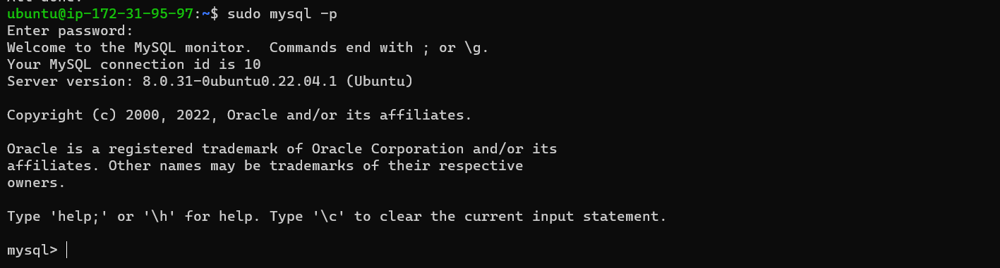
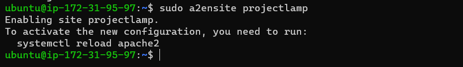
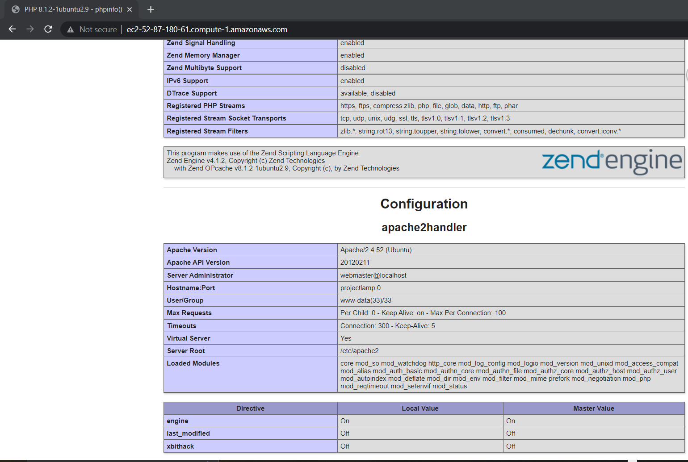

## Project 1 
### LAMB STACK IMPLEMENTATION Using AWS INFRASTRUCTURE
#### STEP 1 - Install Apache using Ubuntu's package manager
> update a list of packages in package manager

    sudo apt update

> run apache2 package installation

    sudo apt install apache2

> verify apache is running as a service in our os

    sudo systemctl status apache2

> updating the firewall on EC2 instance

> Accessing the apache server locally

    curl http://localhost:80 or curl http://127.0.0.1:80

> Accessing the apache server publically

    http://<Public - IP -Address>:80 -syntax
    http://3.89.102.38:80 run on web browser
 

    curl -s http://3.89.102.38 run from terminal

#### STEP 2 INSTALLING MYSQL
> Install DBMS(MYSQL)

      sudo apt install mysql-server

> log into MySQL

      sudo mysql

> Set password for root user for security purposes

    ALTER USER 'root'@'localhost' IDENTIFIED WITH mysql_native_password BY 'PassWord.1';

> Exit MySQL shell

        mysql> exit

> run script to remove insecure default settings and lock down access

         sudo mysql_secure_installation

> Confirm login with password

        sudo mysql -p

> log out of mysql

     mysql> exit

#### STEP 3 INSTALLING PHP
> Packages to enable PHP communicate successfully with Apache and MySQL

         sudo apt install php libapache2-mod-php php -mysql

> Php Version

    php -v 

At this point, your LAMP stack is completely installed and fully operational
- [x] Linux (Ubuntu)
- [x] Apache HTTP Server
- [x] MySQL
- [x] PHP

#### STEP 4 CREATING A VIRTUAL HOST FOR YOUR WEBSITE USING APACHE
>  Create a directory for a domain named projectlamp

       sudo mkdir /var/www/projectlamp
> Assign ownership with your current system user

       sudo chown -R $USER:$USER /var/www/projectlamp
> Create and open a new configuration file in Apache's sites-available directory 

         sudo vi /etc/apache2/sites-available/projectlamp.conf
         <<VirtualHost *:80>
    ServerName projectlamp
    ServerAlias www.projectlamp 
    ServerAdmin webmaster@localhost
    DocumentRoot /var/www/projectlamp
    ErrorLog ${APACHE_LOG_DIR}/error.log
    CustomLog ${APACHE_LOG_DIR}/access.log combined
    </VirtualHost>
    Save and close file
> Show the new file in the sites-available directory

         sudo ls /etc/apache2/sites-available

> Enable new virtual host

          sudo a2ensite projectlamp

> Disable Apache's default website 

        sudo aa2dissite 000-default

> Confirm configuration is free from syntax error

         sudo apache2ctl configtest

> Reload Apache for changes to take effect

         sudo systemctl reload apache2
New website is now active, but the web root/var/www/projectlamp is still empty
> Create an index.html file to test the virtual host works

         sudo echo 'Hello LAMP from hostname' $(curl -s http://169.254.169.254/latest/meta-data/public-hostname) 'with public IP' $(curl -s http://169.254.169.254/latest/meta-data/public-ipv4) > /var/www/projectlamp/index.html
> Open website URL using IP address

         http://52.87.180.61:80

> Open website with DNS name

         http://ec2-52-87-180-61.compute-1.amazonaws.com:80

##### STEP 5 ENABLE PHP ON THE WEBSITE
> Open configuration file

         sudo vim /etc/apache2/mods-enabled/dir.conf
> Make changes on the configuration file

         <IfModule mod_dir.c>
        #Change this:
        #DirectoryIndex index.html index.cgi index.pl index.php index.xhtml index.htm
        #To this:
        DirectoryIndex index.php index.html index.cgi index.pl index.xhtml index.htm
      </IfModule>
Save and close the file
> Reload Apache web server

       sudo systemctl reload apache2
> Create a new PHP script to test that PHP is correctly installed and configured

        vim /var/www/projectlamp/index.php
> Paste this in the blank file

        <?php
        phpinfo();
Save and close the file
> Reload Webpage

> Remove PHP sensitive information

      sudo rm /var/www/projectlamp/index.php

